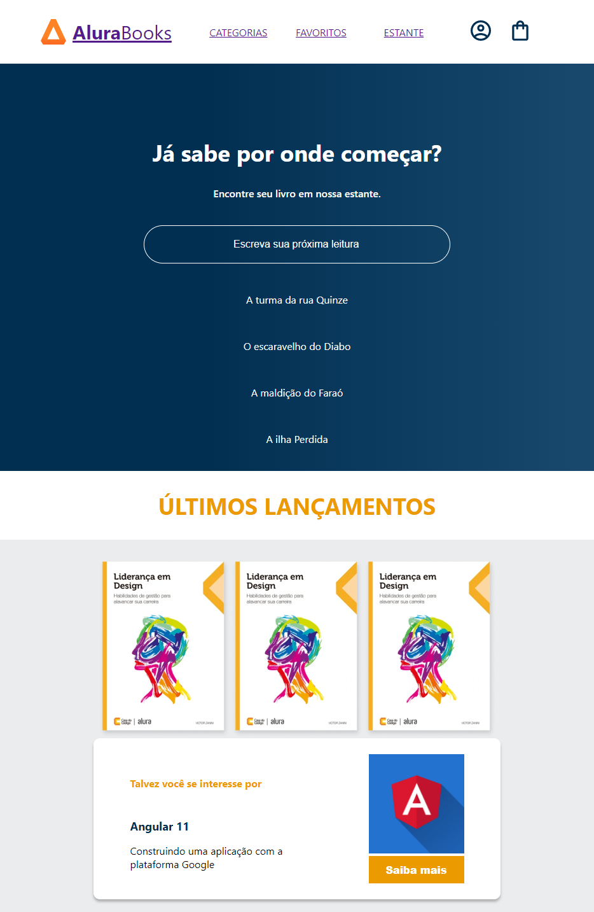
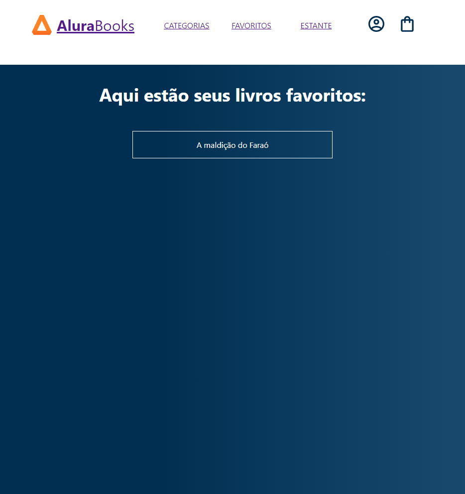

# # Projeto Front-end AluraBooks

- Projeto front-end desenvolvido durante formação full stack node.js da plataforma Alura, este projeto foi desenvolvido em conjunto com o projeto Back-end AluraBooks o qual consistiu na criação de um servidor de dados para este projeto front-end.

## Tecnologias Utilizadas neste Projeto

- React/Js;
- Styled components;
- React-router-dom;
- Axios;

## Após baixar este repositório, para executar o projeto utilize os comandos:

### `npm i`
### `npm start`

*******

## Neste projeto foram desenvolvidas as telas:

 1. Home

 - Esta tela pesquisa e lista os livros cadastrados;

 

 2. Favoritos

 - Listagem dos livros favoritos

 

